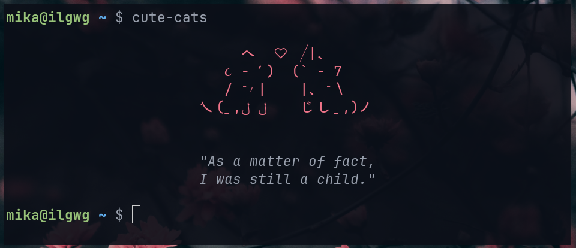

# Terminal Tools

Tools I wrote for a productive working environment. And sometimes, dumb tools that are fun.

Works for Linux only.

# Showcase

## ./cute-cats.sh

You may have seen this in my [dotfiles](https://github.com/iluvgirlswithglasses/dotfiles) already. It's a small, customizable script that dynamically print cute little things to your terminal.

By "dynamic" I mean... centered content lol.

